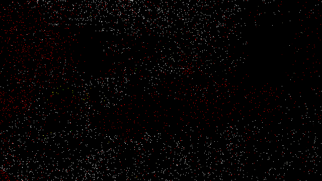
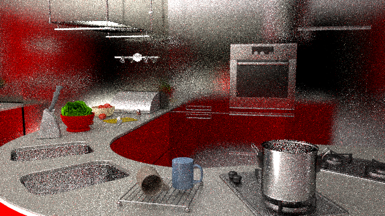
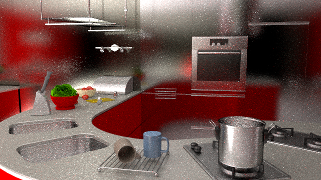

## Practical Path Guiding for Efficient Light-Transport Simulation

This repository contains the authors' implementation of the guided unidirectional path tracer of the research paper ["Practical Path Guiding for Efficient Light-Transport Simulation" [Müller et al. 2017]](https://tom94.net). It also includes a visualization tool for the SD-Trees learned by the guided path tracer. The guided path tracer has been implemented in the [Mitsuba Physically Based Renderer](http://mitsuba-renderer.org) and the visualization tool with the [nanogui](https://github.com/wjakob/nanogui) library.

### No Support for Participating Media

The guided path tracer in this repository was not designed to handle participating media, although it could potentially be extended with little effort. In its current state, scenes containing participating media might converge slowly or not to the correct result at all.

## Example Renders

| Unidir. path tracing (no NEE) | + Müller et al. 2017 | + improvements |
|:---:|:---:|:---:|
|  |  |  |

Note: the above glossy kitchen scene is not bundled in this repository due to licensing. It can be bought [here](https://evermotion.org/shop/show_product/archinteriors-01-for-maya/3556).

## Improvements

This repository contains the following improvements over what was presented in the paper of Müller et al. [2017]:
- Inverse-variance-based sample combination to discard fewer samples.
- Filtered SD-tree splatting for increased robustness.
- Automatic learning of the BSDF / SD-tree sampling ratio via gradient descent based on the theory of [Neural Importance Sampling [Müller et al. 2018]](https://tom94.net).

To see the effect of each of these improvements, compare the above example renders with [only the inverse-variance-based sample combination](resources/glossy-kitchen-inverse-variance-only.png), [only filtered SD-tree splatting](resources/glossy-kitchen-splatting-only.png) and [only sampling ratio learning](resources/glossy-kitchen-mis-only.png).

Since these improvements significantly improve the algorithm, they are *disabled* by default for reproducibility of the paper's results.
To get the optimal results *with* the improvements, simply add the following parameters to the integrator in the scene XML file
```xml
<string name="sampleCombination" value="inversevar"/>
<string name="bsdfSamplingFractionLoss" value="kl"/>
<string name="spatialFilter" value="stochastic"/>
<string name="directionalFilter" value="box"/>
<integer name="sTreeThreshold" value="4000"/>
<integer name="sppPerPass" value="1"/>
```

Each bundled scene comes with two XML files: *scene.xml* without the above improvements, and *scene-improved.xml* with the above improvements.

## Scenes

The CBOX scene was not shown in the paper but is included in this repository.
It was downloaded from the [Mitsuba website](http://mitsuba-renderer.org/download.html) and modified such that the light source points towards the ceiling.
This makes this scene a good test case for indirect diffuse illumination.

The GLOSSY KITCHEN scene (from the above images) can be bought [here](https://evermotion.org/shop/show_product/archinteriors-01-for-maya/3556).
It contains difficult glossy light transport that greatly benefits from path guiding and automatic MIS weight learning.

The KITCHEN scene from the paper is included in this repository.
It was originally modeled by [Jay-Artist on Blendswap](http://www.blendswap.com/user/Jay-Artist), converted into a Mitsuba scene by [Benedikt Bitterli](https://benedikt-bitterli.me/resources/), and then slightly modified by us.
The scene is covered by the [CC BY 3.0 license](https://creativecommons.org/licenses/by/3.0/).
The kitchen illustrates the benefit of path guiding under a mix of difficult indirect and direct illumination.

The POOL scene—created by Ondřej Karlík—is bundled with the [public source code of the method by Vorba et al. [2014]](http://cgg.mff.cuni.cz/~jirka/papers/2014/olpm/index.htm).
The caustics on the floor of the pool are a good showcase of the effectiveness of path guiding under high-frequency illumination.

The SPACESHIP scene was not shown in the paper but is included in this repository.
It was originally modeled by [thecali on Blendswap](http://www.blendswap.com/user/thecali), converted into a Mitsuba scene by [Benedikt Bitterli](https://benedikt-bitterli.me/resources/), and then slightly modified by us.
Due to its mix of highly-glossy and diffuse materials, the scene is an excellent test case for learned MIS weights between path guiding and BSDF sampling.
The scene is [public domain](https://creativecommons.org/publicdomain/zero/1.0/).

The TORUS scene is available for download on the [Mitsuba website](http://mitsuba-renderer.org/download.html).
It was created by Olesya Jakob.
The torus, situated inside of a glass cube, gives rise to difficult specular-diffuse-specular light transport that most unbiased algorithms can not efficiently handle.


## Implementation

- The guided path tracer is implemented as the `GuidedPathTracer` Mitsuba integrator.
- The visualization tool is implemented as a standalone program built on nanogui.

### Modifications to Mitsuba

- `BlockedRenderProcess` (*renderproc.cpp, renderproc.h*)
  - Allowed retrieving the total amount of blocks.
  - Disabled automatic progress bookkeeping.
- `GuidedPathTracer` (*guided_path.cpp*)
  - Added the guided path tracer implementing [Müller et al. 2017].
  - Additionally, implemented the following improvements that are not implemented in the paper:
    - Inverse-variance-based sample combination.
    - Filtered SD-tree splatting.
    - Automatic learning of the BSDF / SD-tree sampling ratio via gradient descent based on the theory of [Neural Importance Sampling [Müller et al. 2018]](https://tom94.net).
- `ImageBlock` (*imageblock.h*)
  - Allowed querying the reconstruction filter.
- `MainWindow` (*mainwindow.cpp*)
  - Removed warning about orphaned rectangular work units (occured when multiple threads write into spatially overlapping blocks at the same time).
- General
  - Added `GuidedPathTracer` to *src/integrator/SConscript* (for compilation) and *src/mtsgui/resources/docs.xml* (for mtsgui).
  - Changed the Visual Studio 2010 project to a Visual Studio 2013 project to make our integrator compile.
  - Removed the Irawan BSDF to make mitsuba compile under newer GCC versions.
  - Fixed various issues of the PLY parser to make mitsuba compile under newer GCC versions and clang.

### Modifications to nanogui

- `ImageView` (*imageview.cpp, imageview.h*)
  - Changed the shader to display a false-color visualization of a given high-dynamic-range image.
- General
  - Removed `noexcept` qualifiers to make nanogui compile under Visual Studio 2013.
  - Removed `constexpr` qualifiers to make nanogui compile under Visual Studio 2013.

## Compilation

### Mitsuba

To compile the Mitsuba code, please follow the instructions from the [Mitsuba documentation](http://mitsuba-renderer.org/docs.html) (sections 4.1.1 through 4.6). Since our new code uses C++11 features, a slightly more recent compiler and dependencies than reported in the mitsuba documentation may be required. We only support compiling mitsuba with the [scons](https://www.scons.org) build system.

We tested our Mitsuba code on
- Windows (Visual Studio 2013 Win64, custom dependencies via `git clone https://github.com/Tom94/mitsuba-dependencies-windows mitsuba/dependencies`)
- macOS (High Sierra / Mojave, custom dependencies via `git clone https://github.com/Tom94/mitsuba-dependencies-macOS mitsuba/dependencies`)
- Linux (GCC 6.3.1)

### Visualization Tool

The visualization tool, found in the *visualizer* subfolder, uses the [CMake](https://cmake.org/) build system. Simply invoke the CMake generator on the *visualizer* subfolder to generate Visual Studio project files on Windows, and a Makefile on Linux / OS X.

The visualization tool was tested on
- Windows (Visual Studio 2013-2017 Win64)
- macOS (High Sierra)
- Linux (GCC 6.3.1)

## License

The new code introduced by this project is licensed under the GNU General Public License (Version 3). Please consult the bundled LICENSE file for the full license text.

The bundled KITCHEN scene is governed by the [CC-BY 3.0 license](https://creativecommons.org/licenses/by/3.0/).
